# School_District_Analysis
 
## Overview
A school board has requested an analysis of school and student data to identify performance trends. Data consists of individual schools and their respective funding, as well as individual students' standardized math and reading test scores.

During analysis is was determined that there was evidence of academic dishonesty in regards to 9th grade scores from a particular High School. While further investigation is required, it is determined that the suspect test scores should be removed from the analysis and summary data updated.

Analysis includes summary district data as well as summaries by school funding, school size, and school type. The school board has requested info on how the analysis was affected by the removal of the suspect test scores.

## Results
Below are the results of the individual analyses with snapshots of the original and updated numbers.

### District Summary
* Original

 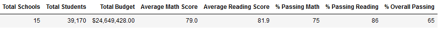

* Updated

 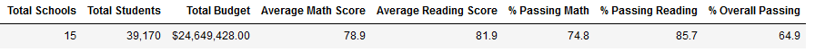
 
 ### School Summary
 * Original

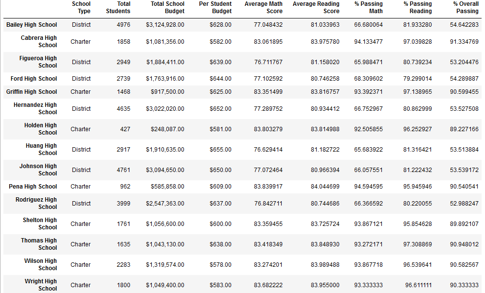

* Updated

 
 
 ### School Reading Scores Summary
 * Original

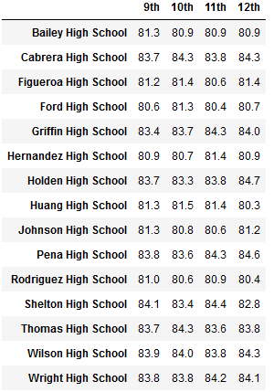

* Updated

 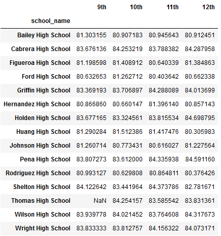
 
 ### School Math Scores Summary
 * Original

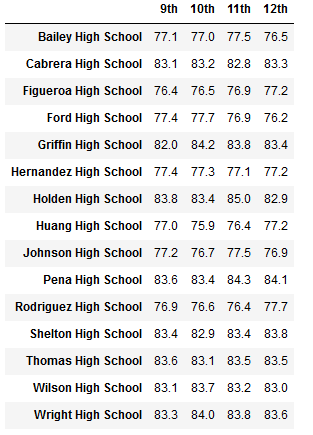

* Updated

 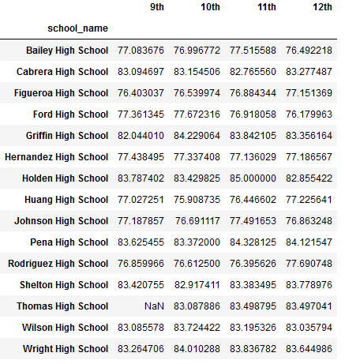
 
 ### Spending Summary
 * Original

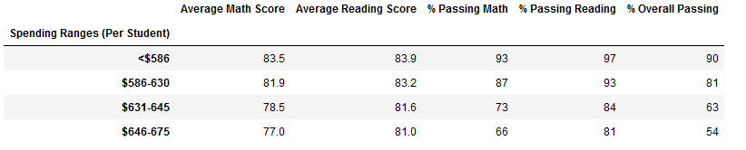

* Updated

 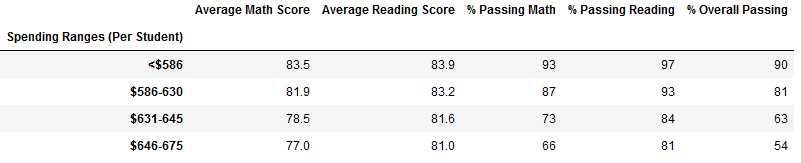
 
  ### Size Summary
 * Original

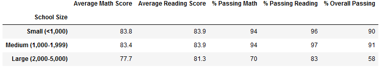

* Updated

 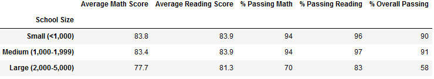
 
  ### Type Summary
 * Original

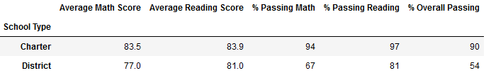

* Updated

 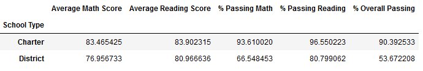
 
 
